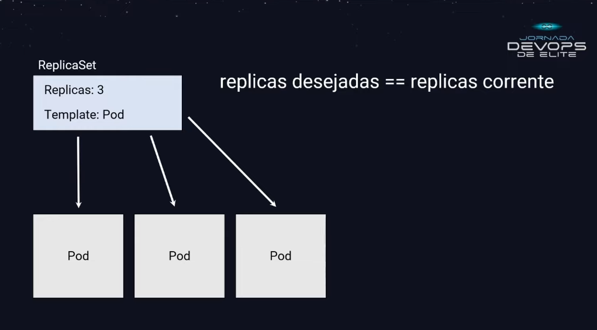
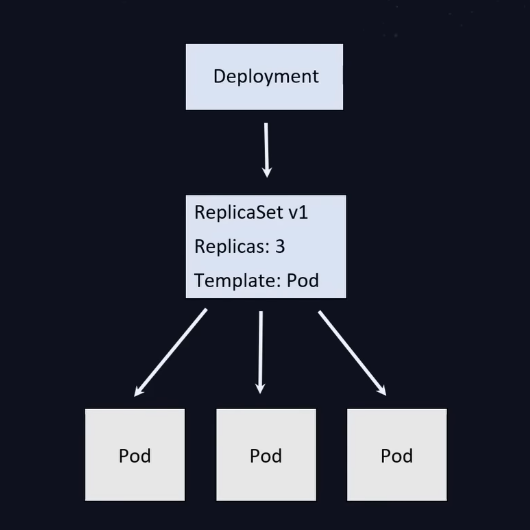
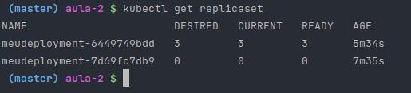
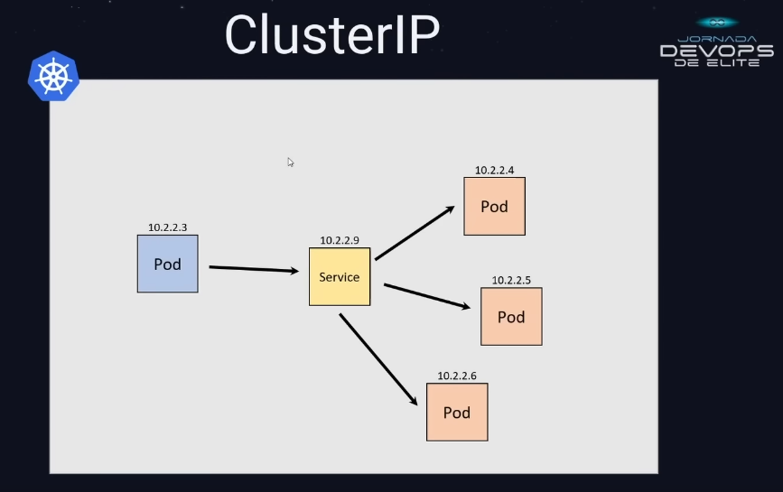
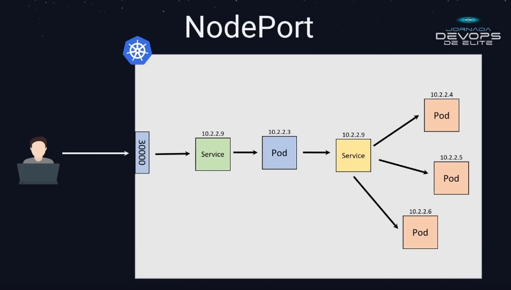
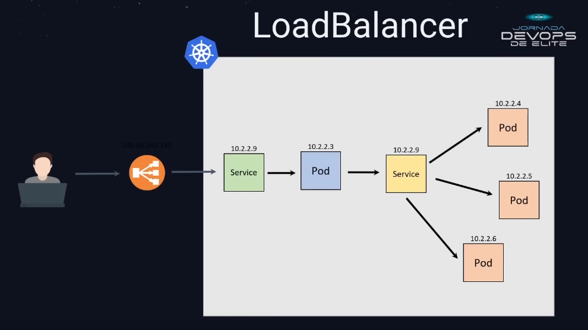

# Notas da aula 2 - Kubernetes

*Notas iniciais: o K3D é uma alternativa de vários aplicativos gestores de clusters kubernetes, 
e o kubectl é a CLI do kubernetes para poder interagir com esses clusters*


## K3D - Comandos

### Criação de cluster

`k3d cluster create` - Comando de criação de cluster kubernetes no k3d

`k3d cluster create <nome-cluster>` - Criando com um nome

Opções para o comando:
- `--server`: quantidade de control planes (ou tmb chamado de master)
- `--agents`: quantidade de worker nodes (ou tmb chamado de nós)

### Exibir os clusters

`k3d cluster list` - Exibir os clusters

### Exibir os nós do cluster
`k3d node list` - Listar os nós do cluster kubernetes

### Deletar cluster
`k3d cluster delete` - Deletar um cluster

`k3d cluster delete <nome-cluster>` - Deleter cluster específico

## Kubernetes

## Pod

#### Pod - Definição: 
- Menor elemento de um cluster kubernets, é ali onde executa os containers, pode ter vários containers dentro do pod.
- Os containers compartilham o mesmo IP e file system
- Cria uma camada para execução dos containers

#### Pod - Deploy de pods de forma certa:
- Na hora de escalar a aplicação, você não cria réplicas dos containers, você cria réplicas dos pods
- Vai ter um pod para cada elemento da aplicação, um pod para o BD, um pod pra API, um pod pro site por exemplo.

#### Pod - Arquivo de manifesto
- Para criar qualquer objeto no cluster kubernetes, é necessário criar um arquivo de manifesto
- Um arquivo YAML com todas as especificações que eu quero nesse pod

### Pod - Comandos
`kubectl api-resources` -> para verificar o que vai colocar no campo `apiVersion`

`kubectl apply -f ./pod.yaml` -> para criar ou atualizar

`kubectl create -f ./pod.yaml` -> para criar

`kubectl delete -f ./pod.yaml` -> deleta todos os pods criados pelo manifesto indicado

`kubectl get pods` -> Listar os pods 

`kubectl describe pod <nome do pod>` -> Mais dados em relação ao pod

`kubectl port-forward pod/<nome do pod> 8080:80 (<host>:<container>)` -> Fazer o redirecionamento para a porta do pod

`kubectl delete pod <nome do pod>` -> Deletar o pod

## Replicaset

Antes de entender o replicaset precisa-se entender alguns conceitos:

>No kubernetes sempre estamos interagindo com objetos, porém, como sei com qual objeto devo interagir?

*Nota: Tudo através do manifesto*

#### Label

- Elemento chave-valor que coloco no meu objeto para marcar o objeto. Assim como colocar uma fita no pulso de uma certa cor, como se fosse VIP ou Pista

No manifesto é inserido a label dentro da tag metadata da seguinte forma:
```yaml
metadata:
  name: <nome-do-pod>
  labels: # Nota: Pode ser qualquer chave com qualquer valor
    <chave-label1>: <valor-label2>
```

#### Selector

- Selecionar o objeto baseado na label do objeto. Como por ex. selecionar todos que possuem a pusseira VIP

Para selecionar pela tag utilizando o `kubectl` utilize:

`kubectl get pods -l <chave-label>=<valor-label>` -> Listando os pods com uma tag específica

### Replicaset - Definição

- Replicaset é um controlador no kubernetes resposável por garantir que a quantidade de réplicas desejadas de um pod 
vai ser igual a quantidade de réplicas executadas no momento



- API utilizada no replicaset
```yaml
# Utilizando o replicaset com os pods
# api-resources:
# NAME          SHORTNAMES   APIVERSION   NAMESPACED  KIND
# replicasets   rs           apps/v1      true        ReplicaSet
apiVersion: apps/v1
```

- Utilizando o selector
```yaml
spec:
  # ...
  selector:
    matchLabels: # Precisa ser igual ao do template dos pods
      <chave-label1>: <valor-label2>
  # ....
```

- Quantidade de replicações
```yaml
spec:
  replicas: 5
  # ...
```

- Criando o template do pod para o replicaset cria-los
```yaml
spec:
  # ...
  template:
    # Criar o pod normalmente como se fosse criado individualmente
    # pelo manifesto individual
    metadata:
    # ...
    spec:
      containers:
        # ...
```

#### Replicaset - Comandos

`kubectl get replicaset` -> Listagem dos replicasets

`kubectl describe replicaset <nome-do-replicaset>` -> Mais dados em relação ao replicaset

## Deployment

- Para que possa modificar o container, sua imagem, por exemplo, e para que essa modificação 
possa afetar todos os pods sobre o gerenciamento do replicaset, é necessário de outro controlador 
que fica acima do replicaset, o deployment.



- Funciona da mesma forma que o replicaset, porém precisa de uma mínima edição:
```yaml
# Na chave kind, trocar de ReplicaSet para Deployment
kind: Deployment
# E no metadata name para não confundir nos logs dps
metadata:
  name: meudeployment
```

- Então, de uma forma resumida, o deployment cria o replicaset com os pods automaticamente,
e quando for feito o `kubectl apply` com as edições, ele vai criar outro replicaset com a nova versão e
gradualmente vai passar os pods para a nova versão modificada, e ao final mantem o replicaset antigo para
poder fazer o rollback



- Para fazer o rollback utilize:

`kubectl rollout undo deployment <nome-do-deployment>` -> Faz o rollback do replicaset no deployment

- Para ir para frente de novo é só fazer o apply novamente

## Service

- Mesmo tendo uma replicação dos pods, não possuem endereçamento e muito menos o balanceamento da carga nos pods,
estão ociosos. Então é necessário um cara na frente para expor os pods e fazer o balanceamento, e ai que entra o service.

- O service é o elemento que vai fazer a comunicação entre os pods, e também externamente no cluster kubernetes.
Toda vez que tiver ali uma comunicação entre os pods (cenário de microsserviços) entra o service para fazer a comunicação.

- Existem vários tipos de service, onde vai depender do tipo de cenário.

`kubectl get svc` -> Listar os services

### Tipos principais de service

#### ClusterIP



- O service que vai gerar a comunicação interna no cluster kubernetes. Ele é o ponto de comunicação com os seus pods internamente.
- Você não vai usar service do tipo ClusterIP para comunicação externa, só realmente interna

#### NodePort



- Consegue expor os serviços externamente
- O nodePort gera uma comunicação expondo uma porta nos nós do cluster kubernetes, então para acessar o service e os pods,
é necessário utilizar o IP de um dos nós do cluster kubernetes.
- O service do tipo NodePort elege uma porta no range de portas 30.000 até o 32.777 para ser a porta de comunicação.


- Obs: O comando para fazer a bind de uma porta para o node é:
`k3d cluster create meucluster -p "80:30000@loadbalancer"` -> esse comando está fazendo a bind da porta 80 do host 
para a 30000 do node e especificando que é o container de loadbalancer. Dessa maneira:

- Você vai poder, no manifesto, especificar que essa porta 80 está apotando para o pod especificado no selector
e que está redirecionando (de novo) para a 8080 desse pod.
```yaml
apiVersion: v1
kind: Service
metadata:
  name: servicewebpage
spec:
  selector:
    app: webpage
  ports:
    - port: 80
      targetPort: 8080
      nodePort: 30000
  type: NodePort
```

#### LoadBalancer



- Cria um IP público para ser utilizado como acesso ao service, 
dessa forma vc vai consumir um serviço do provedor de nuvem

- Ele é utilizado quando está consumindo serviço kubernetes de um cloud provider
- Por padrão não é possível utilizar esse tipo de service, pois foi implementado somente para cloud provides
mais informações: https://metallb.org/#why
